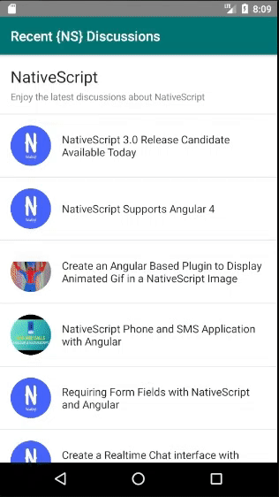

# Flexible List

* ListView with multiple item types that use different ListView item templates
* Multiple item sources
* Loading indicator & fade in implemented

## Reasons for this demo

* It seems to be impossible nesting ListViews into ScrollViews

## Issues

* Disabling user interaction on individual ListView item templates seems to be impossible
* No straight forward way to disable list item dividers

## Help wanted

Do you know a better way to do it or how to fix the issues?   
__Please open up an issue and let me know how this approach could be improved!__